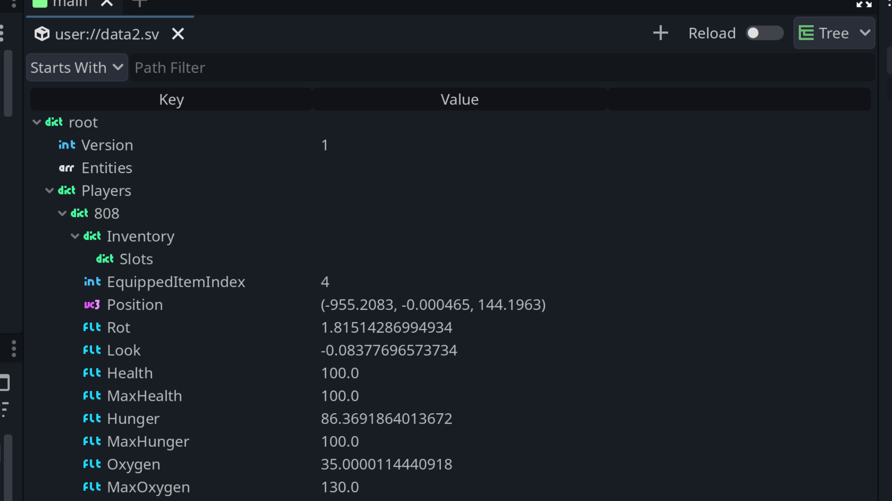

# VarEdit

A serialized Variant editor built into the Godot Editor.

[!NOTE]
This is a work in progress so it only is a viewer at the moment. You can't edit anything yet.

## Installation

- Put `addons/varedit` folder in your project under `addons`.
- Enable the plugin in your project settings.

## License

Licensed under the MIT license, see [LICENSE](./LICENSE) for more information.