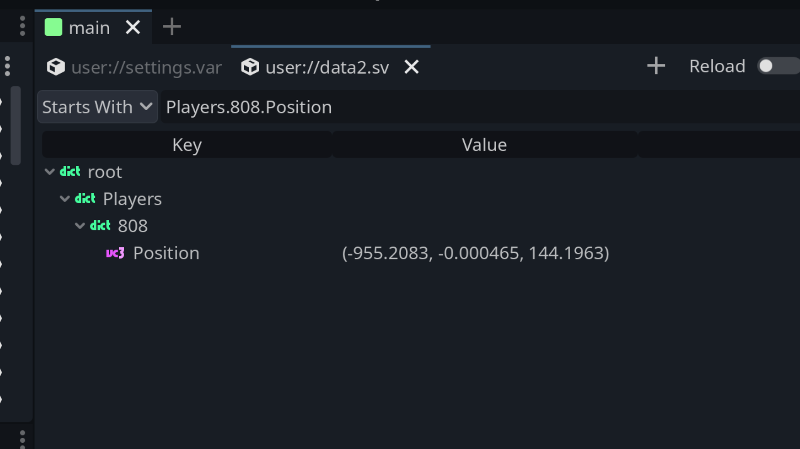

#  VarEdit

A serialized Variant file inspector built into the Godot Editor. 
Perfect for debugging your save files stored using [FileAccess.store_var()](https://docs.godotengine.org/en/stable/classes/class_fileaccess.html#class-fileaccess-method-store-var).

> [!NOTE]
> This is a work in progress so it only is a viewer at the moment. You can't edit anything yet.

## Features
- Displays all Variant types.
- Multiple files open at once as tabs.
- Displays nested dictionaries and arrays.
- Tree or JSON text view.
- Optional auto refresh when the file changes on disk.
- Path filter to only display properties that match a pattern/path.
- Supports files saved with `FileAccess.COMPRESSION_GZIP`.

## Installation

- Put `addons/varedit` folder in your project under `addons`.
- Enable the plugin in your project settings.

## License

Licensed under the MIT license, see [LICENSE](./LICENSE) for more information.